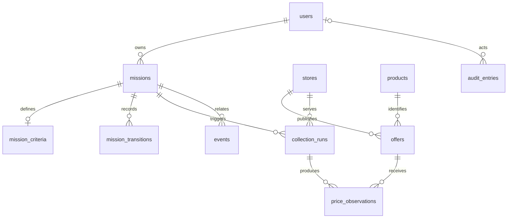

# Modelo de Dados

PostgreSQL é a fonte transacional do MVP. Este documento define o esquema relacional que orientará as migrações e os módulos persistentes, sem criar tabelas nesta etapa.

## Convenções

- Tabelas e colunas usam nomes em inglês, `snake_case` e substantivos no plural para tabelas.
- Chaves primárias usam UUID gerado pela aplicação ou pelo PostgreSQL; identificadores externos nunca são chaves primárias.
- Horários usam `timestamp with time zone` e UTC. Toda entidade mutável possui `created_at` e `updated_at`.
- Valores monetários usam `numeric(19,4)` e uma coluna `currency` `char(3)` no padrão ISO 4217; ponto flutuante é proibido.
- Estados fechados e estáveis podem usar enum PostgreSQL. Categorias extensíveis, como tipos de evento, usam texto validado pela aplicação até possuírem catálogo próprio.
- JSONB é reservado a evidências brutas e payloads variáveis. Dados usados em relações, filtros, ordenação ou invariantes devem estar em colunas tipadas.
- Chaves estrangeiras históricas usam `RESTRICT`; exclusão em cascata não pode remover preços, transições, eventos ou auditoria.
- Exclusão física de registros com histórico associado não pertence ao fluxo normal. Políticas de anonimização e retenção exigem decisão explícita nas tarefas de privacidade.

## Visão relacional

`stores` é uma entidade de apoio necessária para normalizar a origem nacional de cada oferta. Ela não amplia o escopo para marketplaces nem antecipa qualquer Store Provider.

## Entidades

### `users`

Identidade interna usada como proprietária de missões e como ator auditável.

| Coluna | Tipo | Regra |
| --- | --- | --- |
| `id` | `uuid` | Chave primária. |
| `display_name` | `varchar(160)` | Obrigatório. |
| `role` | `varchar(16)` | Obrigatório; valores iniciais `USER`, `ADMIN` ou `DEV`. |
| `is_active` | `boolean` | Obrigatório, padrão `true`. |
| `created_at` | `timestamptz` | Obrigatório. |
| `updated_at` | `timestamptz` | Obrigatório. |

Credenciais e identificadores do Telegram não pertencem a esta tabela nesta fase; autenticação e adaptação de canal serão definidas em tarefas próprias.

Esta entidade foi implementada na TASK-012 pela revisão `20260802_0002`. Seu contrato funcional e limites estão em `docs/USERS.md`.

### `missions`

Intenção persistente de compra e fonte de verdade para seu estado atual.

| Coluna | Tipo | Regra |
| --- | --- | --- |
| `id` | `uuid` | Chave primária. |
| `user_id` | `uuid` | FK obrigatória para `users.id`, com `RESTRICT`. |
| `title` | `varchar(200)` | Obrigatório. |
| `status` | `mission_status` | Obrigatório, padrão `draft`; enum com os seis estados definidos. |
| `expires_at` | `timestamptz` | Nulo para missão permanente. |
| `state_version` | `bigint` | Obrigatório, padrão `0`; incrementado em cada transição para controle concorrente. |
| `created_at` | `timestamptz` | Obrigatório. |
| `updated_at` | `timestamptz` | Obrigatório. |

`mission_status` contém somente `draft`, `active`, `paused`, `completed`, `cancelled` e `expired`. As transições válidas continuam sendo as de `docs/MISSION_SYSTEM.md`; o enum isoladamente não as garante.

Quando presente, `expires_at` deve ser posterior a `created_at`. Uma missão em `draft` pode ainda não possuir critérios; a ativação exige o registro válido descrito abaixo.

Esta entidade foi implementada na TASK-019 pela revisão `20260802_0006`. O
contrato persistente e seus limites estão em `docs/MISSIONS.md`; comandos e
transições permanecem na TASK-021.

### `mission_criteria`

Critérios editáveis da missão, separados do ciclo de vida para evolução na TASK-020.

| Coluna | Tipo | Regra |
| --- | --- | --- |
| `id` | `uuid` | Chave primária. |
| `mission_id` | `uuid` | FK obrigatória e única para `missions.id`, com `RESTRICT`. |
| `search_query` | `text` | Obrigatório e não vazio. |
| `target_amount` | `numeric(19,4)` | Opcional e maior ou igual a zero. |
| `target_currency` | `char(3)` | Obrigatório quando `target_amount` existir e nulo caso contrário. |
| `created_at` | `timestamptz` | Obrigatório. |
| `updated_at` | `timestamptz` | Obrigatório. |

Esta entidade foi implementada na TASK-020 pela revisão `20260802_0007`. Não
foram antecipados filtros adicionais sem requisito concreto; recorrência pertence
à agenda da TASK-022. O contrato e os limites estão em
`docs/MISSION_CRITERIA.md`.

### `mission_transitions`

Histórico imutável do ciclo de vida.

| Coluna | Tipo | Regra |
| --- | --- | --- |
| `id` | `uuid` | Chave primária. |
| `mission_id` | `uuid` | FK obrigatória para `missions.id`, com `RESTRICT`. |
| `from_status` | `mission_status` | Estado anterior obrigatório. |
| `to_status` | `mission_status` | Novo estado obrigatório e diferente do anterior. |
| `command` | `varchar(32)` | Obrigatório; comando definido no ciclo de vida. |
| `actor_type` | `varchar(32)` | Obrigatório; identifica origem humana ou sistêmica. |
| `actor_id` | `uuid` | FK opcional para `users.id`; necessário quando houver usuário interno responsável. |
| `reason` | `text` | Opcional e sem dados sensíveis. |
| `transitioned_at` | `timestamptz` | Obrigatório. |

A atualização de `missions.status` e `state_version` e a inserção da transição deverão ocorrer na mesma transação. Registros desta tabela não são atualizados nem removidos.

### `products`

Identidade canônica de um produto, independente da loja.

| Coluna | Tipo | Regra |
| --- | --- | --- |
| `id` | `uuid` | Chave primária. |
| `name` | `varchar(300)` | Obrigatório. |
| `brand` | `varchar(160)` | Opcional. |
| `model` | `varchar(160)` | Opcional. |
| `created_at` | `timestamptz` | Obrigatório. |
| `updated_at` | `timestamptz` | Obrigatório. |

Esta entidade foi implementada na TASK-013 pela revisão `20260802_0003`.
Não há unicidade artificial apenas por nome nem mesclagem automática; a política
conservadora de identidade e os limites funcionais estão em `docs/PRODUCTS.md`.

### `stores`

Origem nacional normalizada de ofertas.

| Coluna | Tipo | Regra |
| --- | --- | --- |
| `id` | `uuid` | Chave primária. |
| `code` | `varchar(64)` | Obrigatório, único, estável e em `snake_case`. |
| `name` | `varchar(160)` | Obrigatório. |
| `base_url` | `text` | Obrigatório. |
| `is_active` | `boolean` | Obrigatório, padrão `true`. |
| `created_at` | `timestamptz` | Obrigatório. |
| `updated_at` | `timestamptz` | Obrigatório. |

Esta entidade de apoio foi implementada na TASK-014 pela revisão
`20260802_0004`, sem antecipar Store Providers ou coleta.

### `offers`

Anúncio estável de um produto em uma loja. Preço e disponibilidade não ficam nesta tabela porque variam no tempo.

| Coluna | Tipo | Regra |
| --- | --- | --- |
| `id` | `uuid` | Chave primária. |
| `product_id` | `uuid` | FK obrigatória para `products.id`, com `RESTRICT`. |
| `store_id` | `uuid` | FK obrigatória para `stores.id`, com `RESTRICT`. |
| `external_id` | `varchar(255)` | Identificador da loja, opcional quando indisponível. |
| `url` | `text` | URL canônica obrigatória. |
| `created_at` | `timestamptz` | Obrigatório. |
| `updated_at` | `timestamptz` | Obrigatório. |

Deve existir unicidade de `(store_id, external_id)` quando `external_id` não for nulo e, como proteção adicional, de `(store_id, url)`.

Esta entidade foi implementada na TASK-014 pela revisão `20260802_0004`. Seu
contrato, identidade e limites estão em `docs/OFFERS.md`.

### `collection_runs`

Execução rastreável de coleta, sem definir ainda o adaptador ou o agendador.

| Coluna | Tipo | Regra |
| --- | --- | --- |
| `id` | `uuid` | Chave primária. |
| `mission_id` | `uuid` | FK opcional para `missions.id`, com `RESTRICT`. |
| `store_id` | `uuid` | FK obrigatória para `stores.id`, com `RESTRICT`. |
| `status` | `varchar(24)` | Obrigatório; vocabulário será fechado na TASK-026. |
| `started_at` | `timestamptz` | Obrigatório. |
| `finished_at` | `timestamptz` | Opcional e não anterior a `started_at`. |
| `created_at` | `timestamptz` | Obrigatório. |
| `updated_at` | `timestamptz` | Obrigatório. |

### `price_observations`

Evidência imutável de preço e disponibilidade obtida em uma coleta.

| Coluna | Tipo | Regra |
| --- | --- | --- |
| `id` | `uuid` | Chave primária. |
| `offer_id` | `uuid` | FK obrigatória para `offers.id`, com `RESTRICT`. |
| `collection_run_id` | `uuid` | FK obrigatória para `collection_runs.id`, com `RESTRICT`. |
| `amount` | `numeric(19,4)` | Obrigatório e maior ou igual a zero. |
| `currency` | `char(3)` | Obrigatório. |
| `availability` | `varchar(32)` | Obrigatório; vocabulário será definido na TASK-025. |
| `observed_at` | `timestamptz` | Obrigatório; instante informado pela coleta. |
| `recorded_at` | `timestamptz` | Obrigatório; instante de persistência. |
| `raw_evidence` | `jsonb` | Opcional; evidência sanitizada necessária à rastreabilidade. |

Cada coleta válida adiciona uma linha. Não há `updated_at`, operação de atualização nem unicidade que descarte observações repetidas. Correções futuras devem ser anexadas e auditadas, nunca sobrescrever a evidência original.

### `events`

Registro durável de fatos de domínio para publicação e consumo futuros.

| Coluna | Tipo | Regra |
| --- | --- | --- |
| `id` | `uuid` | Chave primária. |
| `event_type` | `varchar(120)` | Obrigatório; catálogo será definido na TASK-042. |
| `aggregate_type` | `varchar(64)` | Obrigatório. |
| `aggregate_id` | `uuid` | Obrigatório. |
| `mission_id` | `uuid` | FK opcional para `missions.id`, com `RESTRICT`. |
| `payload` | `jsonb` | Obrigatório, sem segredos. |
| `occurred_at` | `timestamptz` | Obrigatório. |
| `recorded_at` | `timestamptz` | Obrigatório. |

Detalhes de publicação, tentativas e consumo pertencem às TASKs 043 e 044.

### `audit_entries`

Trilha imutável para ações relevantes que não são substituídas por logs operacionais.

| Coluna | Tipo | Regra |
| --- | --- | --- |
| `id` | `uuid` | Chave primária. |
| `actor_type` | `varchar(32)` | Obrigatório. |
| `actor_id` | `uuid` | Opcional; FK para `users.id` quando representar usuário interno. |
| `action` | `varchar(120)` | Obrigatório e estável. |
| `resource_type` | `varchar(64)` | Obrigatório. |
| `resource_id` | `uuid` | Obrigatório. |
| `metadata` | `jsonb` | Obrigatório, padrão `{}`, sem segredos. |
| `created_at` | `timestamptz` | Obrigatório. |

Esta entidade foi implementada na TASK-016 pela revisão `20260802_0005`. O
PostgreSQL rejeita atualizações e exclusões por trigger; contrato e limites estão
em `docs/AUDIT.md`.

## Índices mínimos

- `missions (user_id, status, created_at desc)` para listagens do proprietário.
- `missions (status, expires_at)` parcial para prazos não nulos de estados não terminais.
- `mission_transitions (mission_id, transitioned_at, id)` para histórico determinístico.
- `offers (product_id)` e `offers (store_id)` além das unicidades definidas.
- `collection_runs (mission_id, started_at desc)` e `collection_runs (store_id, started_at desc)`.
- `price_observations (offer_id, observed_at desc, id)` para histórico de uma oferta.
- `price_observations (collection_run_id)` para rastrear os resultados de uma coleta.
- `events (aggregate_type, aggregate_id, occurred_at, id)` e `events (mission_id, occurred_at, id)`.
- `audit_entries (resource_type, resource_id, created_at, id)` e `audit_entries (actor_id, created_at)` quando `actor_id` não for nulo.

Índices adicionais devem ser justificados por consultas reais; não serão antecipados.

## Consistência e limites de implementação

- O banco deve reforçar nulabilidade, chaves, unicidade, domínios monetários e relações. Regras que dependem do estado atual, como transições, também serão validadas pelo domínio dentro da mesma transação.
- Códigos de moeda devem conter três letras ASCII maiúsculas. URLs e textos obrigatórios não aceitam valores vazios após normalização.
- Resultados históricos usam ordenação composta por horário e `id`, evitando ambiguidade quando dois registros tiverem o mesmo instante.
- `updated_at` não é evidência de domínio; transições, preços, eventos e auditoria possuem seus próprios horários imutáveis.
- O modelo não armazena credenciais, tokens, conteúdo integral de páginas ou dados pessoais desnecessários.
- Migrações, metadata ORM, sessões e conexão foram configuradas na TASK-011. `users`, `products`, `stores`, `offers`, `audit_entries`, `missions` e `mission_criteria` já foram implementados. Observações de preço ocorrem na TASK-015 após a persistência de coletas da TASK-026; consultas históricas permanecem na TASK-017.
