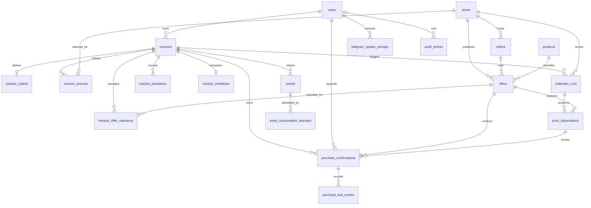

# Modelo de Dados

PostgreSQL é a fonte transacional do MVP. Este documento define o esquema relacional que orientará as migrações e os módulos persistentes, sem criar tabelas nesta etapa.

## Convenções

- Tabelas e colunas usam nomes em inglês, `snake_case` e substantivos no plural para tabelas.
- Chaves primárias usam UUID gerado pela aplicação ou pelo PostgreSQL; identificadores externos nunca são chaves primárias.
- Horários usam `timestamp with time zone` e UTC. Toda entidade mutável possui `created_at` e `updated_at`.
- Valores monetários usam `numeric(19,4)` e uma coluna `currency` `char(3)` no padrão ISO 4217; ponto flutuante é proibido.
- Estados fechados e estáveis podem usar enum PostgreSQL. Categorias extensíveis, como tipos de evento, usam texto validado pela aplicação até possuírem catálogo próprio.
- JSONB é reservado a evidências brutas e payloads variáveis. Dados usados em relações, filtros, ordenação ou invariantes devem estar em colunas tipadas.
- Chaves estrangeiras históricas usam `RESTRICT`; exclusão em cascata não pode remover preços, transições, eventos ou auditoria.
- Exclusão física de registros com histórico associado não pertence ao fluxo
  normal. A TASK-050 remove identificadores diretos e neutraliza textos
  mutáveis, mas mantém UUID interno e fatos append-only: é desidentificação/
  pseudonimização operacional, não anonimização irreversível. PII encontrada
  em histórico imutável bloqueia a operação; triggers nunca são contornados.

## Visão relacional

`stores` normaliza a origem de cada oferta e diferencia varejistas de marketplaces. Ela não habilita fontes automaticamente nem antecipa qualquer Store Provider.

## Entidades

### `users`

Identidade interna usada como proprietária de missões e como ator auditável.

| Coluna | Tipo | Regra |
| --- | --- | --- |
| `id` | `uuid` | Chave primária. |
| `display_name` | `varchar(160)` | Obrigatório. |
| `role` | `varchar(16)` | Obrigatório; valores iniciais `USER`, `ADMIN` ou `DEV`. |
| `is_active` | `boolean` | Obrigatório, padrão `true`. |
| `telegram_user_id` | `bigint` | Opcional, único; identifica a pessoa no Telegram (TASK-056). |
| `telegram_chat_id` | `bigint` | Opcional, único; chat privado da mesma pessoa para notificações (TASK-036). |
| `notify_price_decreases` | `boolean` | Obrigatório, padrão `true`; notificações de queda (TASK-037). |
| `notify_target_reached` | `boolean` | Obrigatório, padrão `true`; notificações de preço-alvo (TASK-037). |
| `username` | `varchar(32)` | Opcional, único; cadastro inicial (TASK-060). |
| `email` | `varchar(254)` | Opcional; cadastro inicial (TASK-060). |
| `favorite_stores` | `varchar(32)[]` | Obrigatório, padrão `{}`; cadastro inicial (TASK-060). |
| `preferred_categories` | `varchar(64)[]` | Obrigatório, padrão `{}`; cadastro inicial (TASK-060). |
| `registration_step` | `varchar(32)` | Opcional; passo pendente do `/cadastro` (TASK-060). |
| `created_at` | `timestamptz` | Obrigatório. |
| `updated_at` | `timestamptz` | Obrigatório. |

Credenciais de autenticação real (senha, token) não pertencem a esta tabela nesta fase — ver TASK-061.

Esta entidade foi implementada na TASK-012 pela revisão `20260802_0002`,
`telegram_user_id` pela revisão `20260807_0001`, os campos do cadastro
inicial pela revisão `20260808_0001` e `telegram_chat_id` pela revisão
`20260808_0005` e as preferências de notificação pela revisão
`20260808_0006`. Seu contrato funcional e limites estão em `docs/USERS.md`.

### `missions`

Intenção persistente de compra e fonte de verdade para seu estado atual.

| Coluna | Tipo | Regra |
| --- | --- | --- |
| `id` | `uuid` | Chave primária. |
| `user_id` | `uuid` | FK obrigatória para `users.id`, com `RESTRICT`. |
| `title` | `varchar(200)` | Obrigatório. |
| `status` | `mission_status` | Obrigatório, padrão `draft`; enum com os seis estados definidos. |
| `expires_at` | `timestamptz` | Nulo para missão permanente. |
| `state_version` | `bigint` | Obrigatório, padrão `0`; incrementado em cada transição para controle concorrente. |
| `created_at` | `timestamptz` | Obrigatório. |
| `updated_at` | `timestamptz` | Obrigatório. |

`mission_status` contém somente `draft`, `active`, `paused`, `completed`, `cancelled` e `expired`. As transições válidas continuam sendo as de `docs/MISSION_SYSTEM.md`; o enum isoladamente não as garante.

Quando presente, `expires_at` deve ser posterior a `created_at`. Uma missão em `draft` pode ainda não possuir critérios; a ativação exige o registro válido descrito abaixo.

Esta entidade foi implementada na TASK-019 pela revisão `20260802_0006`. O
contrato persistente e seus limites estão em `docs/MISSIONS.md`; comandos e
transições foram implementadas na TASK-021.

### `mission_criteria`

Critérios editáveis da missão, separados do ciclo de vida para evolução na TASK-020.

| Coluna | Tipo | Regra |
| --- | --- | --- |
| `id` | `uuid` | Chave primária. |
| `mission_id` | `uuid` | FK obrigatória e única para `missions.id`, com `RESTRICT`. |
| `search_query` | `text` | Obrigatório e não vazio. |
| `target_amount` | `numeric(19,4)` | Opcional e maior ou igual a zero. |
| `target_currency` | `char(3)` | Obrigatório quando `target_amount` existir e nulo caso contrário. |
| `created_at` | `timestamptz` | Obrigatório. |
| `updated_at` | `timestamptz` | Obrigatório. |

Esta entidade foi implementada na TASK-020 pela revisão `20260802_0007`. Não
foram antecipados filtros adicionais sem requisito concreto; recorrência pertence
à agenda da TASK-022. O contrato e os limites estão em
`docs/MISSION_CRITERIA.md`.

### `mission_sources`

Seleção explícita das fontes pesquisadas por uma missão.

| Coluna | Tipo | Regra |
| --- | --- | --- |
| `mission_id` | `uuid` | FK para `missions.id`, parte da PK, com `RESTRICT`. |
| `store_id` | `uuid` | FK para `stores.id`, parte da PK, com `RESTRICT`. |
| `created_at` | `timestamptz` | Obrigatório. |

Uma missão pode selecionar várias fontes, sem duplicá-las. Ativação e retomada
exigem ao menos uma seleção. A estrutura foi adicionada pela revisão
`20260802_0009` para corrigir o escopo da TASK-020.

### `mission_offer_relevance`

Classificação por IA da correspondência entre uma missão e uma oferta
coletada (TASK-063, `DEC-048`).

| Coluna | Tipo | Regra |
| --- | --- | --- |
| `mission_id` | `uuid` | FK para `missions.id`, parte da PK, com `RESTRICT`. |
| `offer_id` | `uuid` | FK para `offers.id`, parte da PK, com `RESTRICT`; indexada. |
| `classification` | `offer_relevance` | `match`, `possible_match` ou `no_match`. |
| `classified_at` | `timestamptz` | Obrigatório. |
| `created_at` | `timestamptz` | Obrigatório. |

Chave natural `(mission_id, offer_id)`: a mesma `Offer` pode ser `match` para
uma missão e `no_match` para outra. Os insumos da classificação (busca da
missão, título bruto da oferta) são imutáveis depois que ambas existem, então
uma linha nunca é reclassificada — só criada quando ainda não existe, e só
quando a IA devolve uma resposta válida (falha/resposta inválida não é
persistida, para tentar de novo na próxima coleta). Só `match` habilita
`evaluate_price_alerts` (`docs/PRICE_ALERTS.md`) para aquela observação;
`possible_match`, `no_match` e ausência de classificação são todos
conservadores (sem alerta). Adicionada pela revisão `20260809_0004`.

### `mission_transitions`

Histórico imutável do ciclo de vida.

| Coluna | Tipo | Regra |
| --- | --- | --- |
| `id` | `uuid` | Chave primária. |
| `mission_id` | `uuid` | FK obrigatória para `missions.id`, com `RESTRICT`. |
| `from_status` | `mission_status` | Estado anterior obrigatório. |
| `to_status` | `mission_status` | Novo estado obrigatório e diferente do anterior. |
| `command` | `varchar(32)` | Obrigatório; comando definido no ciclo de vida. |
| `actor_type` | `varchar(32)` | Obrigatório; identifica origem humana ou sistêmica. |
| `actor_id` | `uuid` | FK opcional para `users.id`; necessário quando houver usuário interno responsável. |
| `reason` | `text` | Opcional e sem dados sensíveis. |
| `transitioned_at` | `timestamptz` | Obrigatório. |

A atualização de `missions.status` e `state_version` e a inserção da transição deverão ocorrer na mesma transação. Registros desta tabela não são atualizados nem removidos.

Esta entidade e a execução atômica do ciclo de vida foram implementadas na
TASK-021 pela revisão `20260802_0008`. O contrato operacional está em
`docs/MISSION_TRANSITIONS.md`.

### `mission_schedules`

Agenda recorrente e editável de uma missão.

| Coluna | Tipo | Regra |
| --- | --- | --- |
| `id` | `uuid` | Chave primária. |
| `mission_id` | `uuid` | FK obrigatória e única para `missions.id`, com `RESTRICT`. |
| `interval_minutes` | `integer` | Obrigatório e maior que zero. |
| `next_run_at` | `timestamptz` | Próxima execução elegível, obrigatória. |
| `last_run_at` | `timestamptz` | Última execução iniciada, opcional e não posterior à próxima. |
| `is_enabled` | `boolean` | Obrigatório, padrão `true`. |
| `created_at` | `timestamptz` | Obrigatório. |
| `updated_at` | `timestamptz` | Obrigatório. |

Implementada na TASK-022 pela revisão `20260802_0010`. O contrato operacional
está em `docs/MISSION_SCHEDULES.md`.

### `products`

Identidade canônica de um produto, independente da loja.

| Coluna | Tipo | Regra |
| --- | --- | --- |
| `id` | `uuid` | Chave primária. |
| `name` | `varchar(300)` | Obrigatório; título bruto da primeira coleta daquela oferta, nunca reescrito. |
| `brand` | `varchar(160)` | Opcional. |
| `model` | `varchar(160)` | Opcional. |
| `display_name` | `varchar(300)` | Opcional; título normalizado por IA para exibição (TASK-063), separado de `name`. |
| `created_at` | `timestamptz` | Obrigatório. |
| `updated_at` | `timestamptz` | Obrigatório. |

Esta entidade foi implementada na TASK-013 pela revisão `20260802_0003`.
Não há unicidade artificial apenas por nome nem mesclagem automática; a política
conservadora de identidade e os limites funcionais estão em `docs/PRODUCTS.md`.
`display_name` foi adicionado pela revisão `20260809_0004` (TASK-063):
normalizado uma única vez via `AIProviderManager` a partir do título bruto,
nunca substitui `name`, e fica `NULL` até a normalização ter sucesso — o
notifier usa `name` como alternativa enquanto isso.

### `stores`

Origem normalizada de ofertas de varejista ou marketplace.

| Coluna | Tipo | Regra |
| --- | --- | --- |
| `id` | `uuid` | Chave primária. |
| `code` | `varchar(64)` | Obrigatório, único, estável e em `snake_case`. |
| `name` | `varchar(160)` | Obrigatório. |
| `base_url` | `text` | Obrigatório. |
| `source_type` | `varchar(16)` | `retailer` ou `marketplace`; padrão `retailer`. |
| `is_active` | `boolean` | Obrigatório, padrão `true`. |
| `created_at` | `timestamptz` | Obrigatório. |
| `updated_at` | `timestamptz` | Obrigatório. |

Esta entidade de apoio foi implementada na TASK-014 pela revisão
`20260802_0004` e ampliada pela revisão `20260802_0009`, sem antecipar Store
Providers ou coleta.

### `sellers`

Vendedor estável dentro de um marketplace.

| Coluna | Tipo | Regra |
| --- | --- | --- |
| `id` | `uuid` | Chave primária. |
| `store_id` | `uuid` | FK para `stores.id`, com `RESTRICT`; a fonte precisa ser marketplace. |
| `external_id` | `varchar(255)` | Opcional e único por marketplace quando informado. |
| `name` | `varchar(200)` | Obrigatório e não vazio. |
| `created_at` | `timestamptz` | Obrigatório. |
| `updated_at` | `timestamptz` | Obrigatório. |

Triggers impedem vendedor em varejista e impedem reclassificar como varejista um
marketplace que já possua vendedores.

### `offers`

Anúncio estável de um produto em uma loja. Preço e disponibilidade não ficam nesta tabela porque variam no tempo.

| Coluna | Tipo | Regra |
| --- | --- | --- |
| `id` | `uuid` | Chave primária. |
| `product_id` | `uuid` | FK obrigatória para `products.id`, com `RESTRICT`. |
| `store_id` | `uuid` | FK obrigatória para `stores.id`, com `RESTRICT`. |
| `seller_id` | `uuid` | FK composta opcional com `store_id` para `sellers`; nula no varejo. |
| `external_id` | `varchar(255)` | Identificador da loja, opcional quando indisponível. |
| `url` | `text` | URL canônica obrigatória. |
| `created_at` | `timestamptz` | Obrigatório. |
| `updated_at` | `timestamptz` | Obrigatório. |

No varejo, a identidade é única por fonte. Em marketplace, é única por fonte e
vendedor, permitindo o mesmo anúncio para vendedores diferentes.

Esta entidade foi implementada na TASK-014 pela revisão `20260802_0004` e
corrigida para marketplaces pela revisão `20260802_0009`. Seu contrato está em
`docs/OFFERS.md`.

### `collection_runs`

Execução rastreável de coleta, sem definir ainda o adaptador ou o agendador.

| Coluna | Tipo | Regra |
| --- | --- | --- |
| `id` | `uuid` | Chave primária. |
| `mission_id` | `uuid` | FK opcional para `missions.id`, com `RESTRICT`. |
| `store_id` | `uuid` | FK obrigatória para `stores.id`, com `RESTRICT`. |
| `status` | `collection_run_status` | Obrigatório; `running`, `succeeded` ou `failed`. |
| `started_at` | `timestamptz` | Obrigatório. |
| `finished_at` | `timestamptz` | Opcional e não anterior a `started_at`. |
| `created_at` | `timestamptz` | Obrigatório. |
| `updated_at` | `timestamptz` | Obrigatório. |

### `price_observations`

Evidência imutável de preço e disponibilidade obtida em uma coleta.

| Coluna | Tipo | Regra |
| --- | --- | --- |
| `id` | `uuid` | Chave primária. |
| `offer_id` | `uuid` | FK obrigatória para `offers.id`, com `RESTRICT`. |
| `collection_run_id` | `uuid` | FK obrigatória para `collection_runs.id`, com `RESTRICT`. |
| `amount` | `numeric(19,4)` | Preço do item, obrigatório e maior ou igual a zero. |
| `currency` | `char(3)` | Obrigatório. |
| `shipping_amount` | `numeric(19,4)` | Frete opcional, não negativo e na mesma moeda. |
| `total_amount` | `numeric(19,4)` | Total obrigatório do item e do frete conhecido. |
| `fulfillment` | `varchar(120)` | Responsável pelo envio, opcional. |
| `availability` | `offer_availability` | Obrigatório; `available`, `unavailable` ou `unknown`. |
| `observed_at` | `timestamptz` | Obrigatório; instante informado pela coleta. |
| `recorded_at` | `timestamptz` | Obrigatório; instante de persistência. |
| `raw_evidence` | `jsonb` | Opcional; evidência sanitizada necessária à rastreabilidade. |

Cada coleta válida adiciona uma linha. Não há `updated_at`, operação de atualização nem unicidade que descarte observações repetidas. Correções futuras devem ser anexadas e auditadas, nunca sobrescrever a evidência original.

### `purchase_confirmations`

Solicitação imutável de confirmação e snapshot sanitizado da evidência exibida.

| Coluna | Tipo | Regra |
| --- | --- | --- |
| `id` | `uuid` | PK e `confirmation_id` exposto pelo domínio. |
| `mission_id` | `uuid` | FK `RESTRICT` para a missão. |
| `owner_user_id` | `uuid` | FK `RESTRICT` para o proprietário. |
| `offer_id` | `uuid` | FK `RESTRICT` para a oferta escolhida. |
| `price_observation_id` | `uuid` | FK `RESTRICT` para a observação original, nunca substituída. |
| `product_id`, `store_id`, `seller_id` | `uuid` | Identidade relacional; vendedor é opcional. |
| `position`, `url` | `integer`, `text` | Posição e URL apresentadas. |
| `amount`, `shipping_amount`, `total_amount` | `numeric(19,4)` | Valores não negativos e total exato. |
| `currency` | `char(3)` | Moeda ISO 4217 da confirmação. |
| `availability`, `fulfillment`, `observed_at` | tipos da oferta | Evidência original relevante. |
| `evidence_snapshot` | `jsonb` | Objeto sanitizado com nomes e identificadores exibidos. |
| `requested_at`, `expires_at` | `timestamptz` | UTC e diferença exata de 15 minutos. |
| `recorded_at` | `timestamptz` | Definido exclusivamente pelo PostgreSQL. |

Não existe coluna de status. Trigger rejeita `UPDATE` e `DELETE`. A identidade
composta é referenciada pela trilha para impedir que seus campos relacionais
divirjam da solicitação.

### `purchase_trail_entries`

Histórico append-only da criação e resolução da confirmação.

| Coluna | Tipo | Regra |
| --- | --- | --- |
| `id` | `uuid` | Chave primária. |
| `confirmation_id` | `uuid` | FK real `RESTRICT` para `purchase_confirmations`. |
| `mission_id`, `owner_user_id`, `offer_id`, `price_observation_id` | `uuid` | FKs `RESTRICT` e FK composta para a mesma identidade da confirmação. |
| `entry_type` | enum | `requested`, `confirmed`, `cancelled` ou `stale`. |
| `decision` | enum | `confirm`, `cancel` ou nulo somente em `requested`. |
| `stale_reason` | enum | `expired`, `evidence_changed` ou nulo conforme a matriz. |
| `resolved_at` | `timestamptz` | Nulo em `requested`; obrigatório em terminal. |
| `recorded_at` | `timestamptz` | Definido exclusivamente pelo PostgreSQL. |

Índices únicos parciais limitam cada confirmação a no máximo uma `requested` e
um terminal. O serviço cria confirmação + `requested` atomicamente e insere o
terminal em SAVEPOINT; somente a violação identificada do índice terminal é
convertida em idempotência/conflito de domínio. Trigger bloqueia alteração e
remoção. `confirmed` registra consentimento, nunca compra executada.

### `events`

Registro durável de fatos de domínio para publicação e consumo futuros.

| Coluna | Tipo | Regra |
| --- | --- | --- |
| `id` | `uuid` | Chave primária. |
| `event_type` | `varchar(120)` | Obrigatório; nome versionado de `docs/EVENT_CATALOG.md`. |
| `aggregate_type` | `varchar(64)` | Obrigatório. |
| `aggregate_id` | `uuid` | Obrigatório. |
| `mission_id` | `uuid` | FK opcional para `missions.id`, com `RESTRICT`. |
| `payload` | `jsonb` | Obrigatório, sem segredos. |
| `occurred_at` | `timestamptz` | Obrigatório. |
| `recorded_at` | `timestamptz` | Obrigatório. |

O catálogo lógico foi definido na TASK-042. Persistência e publicação foram
implementadas na TASK-043 pela revisão `20260808_0003` — tabela append-only
(trigger rejeitando `UPDATE`/`DELETE`) e o serviço genérico
`app.events.service.publish_event`, validado contra PostgreSQL real com
candidatos reais de `evaluate_price_alerts` (TASK-027). `recorded_at` é
gerado exclusivamente pelo PostgreSQL (`server_default=now()`), nunca pela
aplicação.

### `event_consumption_attempts`

Histórico imutável dos resultados de consumo por consumidor.

| Coluna | Tipo | Regra |
| --- | --- | --- |
| `id` | `uuid` | Chave primária. |
| `event_id` | `uuid` | FK obrigatória para `events.id`, com `RESTRICT`. |
| `consumer_name` | `varchar(64)` | Obrigatório e não vazio. |
| `outcome` | `consumption_outcome` | Enum `succeeded`, `failed`, `skipped` ou `dead_lettered`. |
| `failure_code` | `varchar(120)` | Nulo em `succeeded`/`skipped`; obrigatório e em snake_case na falha/dead letter. |
| `attempted_at` | `timestamptz` | Obrigatório e informado pelo consumidor. |
| `next_retry_at` | `timestamptz` | Obrigatório somente em `failed` e posterior à tentativa. |

A TASK-044 implementou a tabela pela revisão `20260808_0004`; a TASK-037
adicionou o resultado terminal `skipped` pela revisão `20260808_0006`. Um trigger
rejeita `UPDATE`/`DELETE`; falhas permanecem como evidência e não impedem novo
consumo. A TASK-049 (`20260808_0009`) adicionou retry agendado e
`dead_lettered`, com unicidade parcial para no máximo um terminal por
consumidor/evento. A elegibilidade exclui `succeeded`, `skipped` e
`dead_lettered`; `failed` só volta depois de `next_retry_at`. O contrato está em
`docs/EVENT_CONSUMPTION.md`.

### `telegram_update_receipts`

Fatos mínimos e append-only usados para replay e rate limit do webhook.

| Coluna | Tipo | Regra |
| --- | --- | --- |
| `id` | `uuid` | Chave primária. |
| `update_id` | `bigint` | Obrigatório e único globalmente. |
| `user_id` | `uuid` | FK obrigatória para `users.id`, com `RESTRICT`. |
| `disposition` | `varchar(24)` | `accepted`, `rate_limited` ou `discarded`. |
| `recorded_at` | `timestamptz` | Gerado pelo PostgreSQL. |

A revisão `20260808_0009` criou a tabela e um trigger que rejeita `UPDATE` e
`DELETE`. Não existe estado `processing`; recibo aceito e efeitos funcionais
fazem parte da mesma transação.

### `audit_entries`

Trilha imutável para ações relevantes que não são substituídas por logs operacionais.

| Coluna | Tipo | Regra |
| --- | --- | --- |
| `id` | `uuid` | Chave primária. |
| `actor_type` | `varchar(32)` | Obrigatório. |
| `actor_id` | `uuid` | Opcional; FK para `users.id` quando representar usuário interno. |
| `action` | `varchar(120)` | Obrigatório e estável. |
| `resource_type` | `varchar(64)` | Obrigatório. |
| `resource_id` | `uuid` | Obrigatório. |
| `metadata` | `jsonb` | Obrigatório, padrão `{}`, sem segredos. |
| `created_at` | `timestamptz` | Obrigatório. |

Esta entidade foi implementada na TASK-016 pela revisão `20260802_0005`. O
PostgreSQL rejeita atualizações e exclusões por trigger; contrato e limites estão
em `docs/AUDIT.md`.

## Índices mínimos

- `missions (user_id, status, created_at desc)` para listagens do proprietário.
- `missions (status, expires_at)` parcial para prazos não nulos de estados não terminais.
- `mission_transitions (mission_id, transitioned_at, id)` para histórico determinístico.
- `offers (product_id)`, `offers (store_id)` e `offers (seller_id)` além das unicidades definidas.
- `sellers (store_id)` e unicidade parcial de `(store_id, external_id)`.
- `mission_sources (store_id)` para localizar missões por fonte.
- `mission_offer_relevance (offer_id)` para localizar classificações por oferta.
- `mission_schedules (next_run_at, mission_id)` parcial para agendas habilitadas vencidas.
- `collection_runs (mission_id, started_at desc)` e `collection_runs (store_id, started_at desc)`.
- `price_observations (offer_id, observed_at desc, id)` para histórico de uma oferta.
- `price_observations (collection_run_id)` para rastrear os resultados de uma coleta.
- `events (aggregate_type, aggregate_id, occurred_at, id)` e `events (mission_id, occurred_at, id)`.
- `event_consumption_attempts (consumer_name, event_id)` único parcial para
  terminais (`succeeded`, `skipped`, `dead_lettered`) e índice de retry por
  `next_retry_at`.
- `telegram_update_receipts (update_id)` único e
  `(user_id, recorded_at)` parcial para a janela de updates aceitos.
- `audit_entries (resource_type, resource_id, created_at, id)` e `audit_entries (actor_id, created_at)` quando `actor_id` não for nulo.
- `user_auth_sessions (user_id, telegram_user_id, expires_at)` parcial para
  sessões ainda não revogadas, e `expires_at` parcial para avisos de expiração
  ainda não publicados.
- `credential_action_tokens (user_id, action, created_at)` para rate limiting,
  além de expiração e unicidade do hash do token.

Índices adicionais devem ser justificados por consultas reais; não serão antecipados.

## Consistência e limites de implementação

- O banco deve reforçar nulabilidade, chaves, unicidade, domínios monetários e relações. Regras que dependem do estado atual, como transições, também serão validadas pelo domínio dentro da mesma transação.
- Códigos de moeda devem conter três letras ASCII maiúsculas. URLs e textos obrigatórios não aceitam valores vazios após normalização.
- Resultados históricos usam ordenação composta por horário e `id`, evitando ambiguidade quando dois registros tiverem o mesmo instante.
- `updated_at` não é evidência de domínio; transições, preços, eventos, tentativas de consumo e auditoria possuem seus próprios horários imutáveis.
- Credenciais da TASK-061 ficam somente em `user_credentials`; senha nunca é
  reversível. `credential_action_tokens` guarda somente SHA-256 de tokens
  aleatórios e `user_auth_sessions` guarda estado temporal/revogação. A revisão
  `20260809_0002` acrescenta marcadores idempotentes de publicação do aviso
  prévio e da expiração; linhas anteriores são marcadas na migration para não
  produzir mensagens retroativas.
- Migrações, metadata ORM, sessões e conexão foram configuradas na TASK-011.
  Todas as entidades previstas até `collection_runs` e `price_observations` já
  foram implementadas, além de `events` (TASK-043),
  `event_consumption_attempts` (TASK-044/TASK-049) e
  `telegram_update_receipts` (TASK-049). As consultas históricas da TASK-017 são somente leitura e
  estão documentadas em `docs/PRICE_HISTORY.md`.
